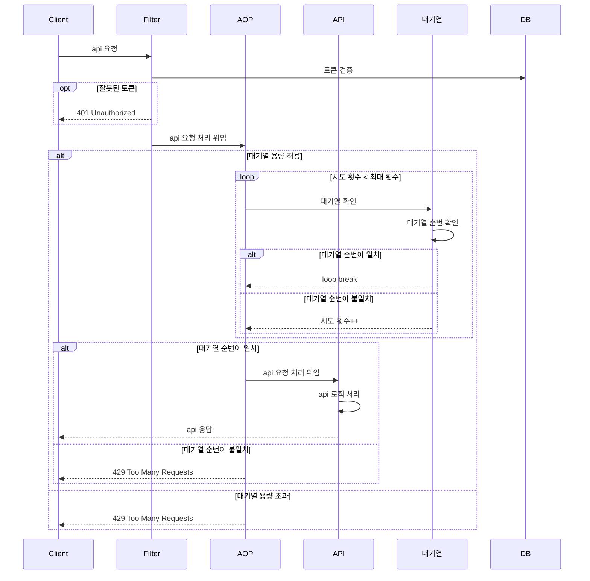
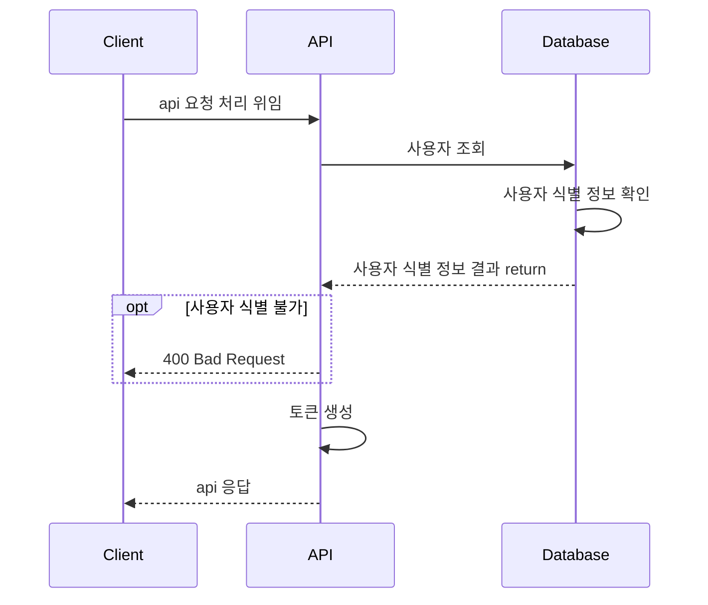
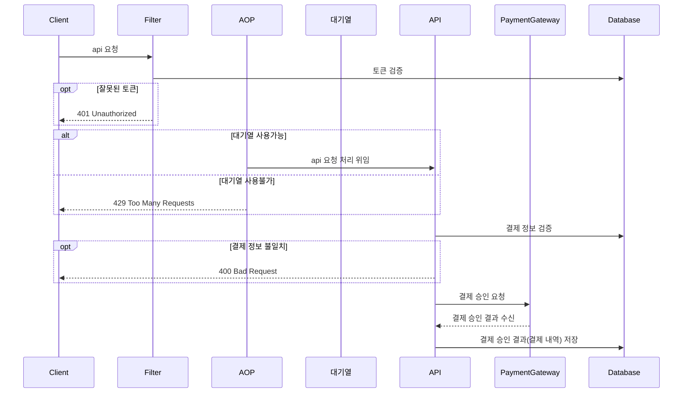
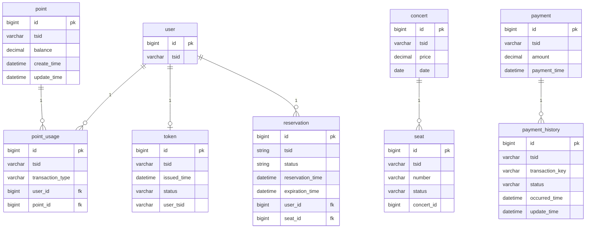

# Ticket
- 콘서트 예약 서비스 구현하기
- 대기열 시스템을 구축하고, 예약 서비스는 작업가능한 유저만 수행할 수 있도록 해야합니다.
- 사용자는 좌석예약 시에 미리 충전한 잔액을 이용합니다.
- 좌석 예약 요청시에, 결제가 이루어지지 않더라도 일정 시간동안 다른 유저가 해당 좌석에 접근할 수 없도록 합니다.

프로젝트를 구성하는데 필요한 마일스톤은 https://github.com/wanniDev/ticket/milestones 에서 확인할 수 있습니다.

## 요구사항 분석
콘서트 예약 서비스를 구현하기 위해선 아래 6가지의 api가 필요합니다.
- 유저 토큰 발급 API
- 예약 가능 날짜 조회 API
- 예약 가능 좌석 조회 API
- 좌석 예약 요청 API
- 잔액 충전 / 조회 API
- 결제 API

### 0. 유저 토큰 대기열 검증


### 1. 유저 토큰 발급 API


### 2. 예약 가능 좌석 조회 API
- 목적 : 사용자가 특정 날짜와 좌석에 대해 예약을 요청할 수 있어야 합니다.
- 핵심 요구사항 :
  - 사용자는 특정 날짜를 선택하여 그 날짜에 대한 예약 가능 좌석을 확인할 수 있어야 합니다.
- 제약사항 :
  - 이미 예약되었거나 임시 배정된 좌석은 예약 가능한 좌석 목록에 포함되지 않아야 합니다.

### 3. 좌석 예약 요청 API
- 목적 : 사용자가 특정 날짜와 좌석에 대해 예약을 요청할 수 있어야 합니다.
- 핵심 요구사항 :
  - 사용자는 토큰을 사용하여 예약 요청을 해야 합니다.
  - 예약이 성공적으로 요청되면, 해당 좌석은 일정 시간 동안 사용자에게 임시 배정됩니다.
- 제약사항 :
  - 한 사용자가 동시에 여러 좌석을 예약할 수 없습니다.
  - 임시 배정 시간 내에 결제가 완료되지 않으면, 좌석 배정이 자동으로 해제됩니다.

### 4. 잔액 충전 / 조회 API
#### 잔액 충전
- 목적 : 사용자가 예약 결제를 위해 잔액을 충전할 수 있어야 합니다.
- 핵심 요구사항 :
  - 사용자는 특정 금액을 지정하여 잔액을 충전할 수 있습니다.
- 제약사항 :
  - 충전 금액은 양수여야 합니다. 

#### 잔액 조회
- 목적 : 사용자가 자신의 현재 잔액을 조회할 수 있어야 합니다.
- 핵심 요구사항 :
  - 사용자는 자신의 잔액 정보를 언제든지 조회할 수 있어야 합니다.
- 제약사항:
  - 조회는 사용자 본인의 잔액에 한정됩니다.
    
### 5. 결제 API
> 해당 API는 PG 사에서 제공하는 결제 모달창 UI를 통해 결제 정보를 입력한 이후에 호출되는 API입니다.</br>
> 이번 프로젝트에서는 비즈니스 로직 구현에 집중하기 위해 PG 연동은 생략하였습니다. </br>

- 목적: 사용자가 좌석 예약에 대해 결제를 완료할 수 있어야 합니다.
- 핵심 요구사항:
  - 사용자는 잔액을 이용하여 예약한 좌석에 대한 결제를 진행할 수 있어야 합니다.
  - 결제가 성공하면, 예약이 확정되고 해당 좌석은 사용자에게 배정됩니다.
- 제약사항:
  - 사용자의 잔액은 결제 금액 이상이어야 합니다.
  - 결제 요청은 유효한 예약 정보에 대해서만 가능해야 합니다.

## API spec

### 0. 유저 토큰 대기열 확인

- **Endpoint:** `/api/token/peek`

- **Method:** `POST`

- **Description:** 사용자에게 대기열 관리를 위한 토큰을 발급합니다.

- **Request Body:**

  ```json
  {
    "tokenId": "string"
  }
  ```

- **Response:**

  - 200 OK

    ```json
    {
      "isTurn" : "boolean",
      "occurredTime": "datetime"
    }
    ```

### 1. 유저 토큰 발급 API

- **Endpoint:** `/api/token`

- **Method:** `POST`

- **Description:** 사용자에게 대기열 관리를 위한 토큰을 발급합니다.

- **Request Body:**

  ```json
  {
    "userId": "string"
  }
  ```

- **Response:**

  - 200 OK

    ```json
    {
      "token": "string",
      "expirationTime": "datetime"
    }
    ```

  - 400 Bad Request

    ```json
    {
      "error": "잘못된 사용자 ID"
    }
    ```

### 2. 예약 가능 날짜 조회 API

- **Endpoint:** `/api/concert/date`

- **Method:** `GET`

- **Description:** 예약 가능한 모든 날짜를 조회합니다.

- **Responses:**

  - 200 OK

    ```json
    {
      "dates": ["yyyy-mm-dd", "yyyy-mm-dd"]
    }
    ```

### 3. 예약 가능 좌석 조회 API

- **Endpoint:** `/api/concert/seat`

- **Method:** `GET`

- **Description:** 특정 날짜에 대한 예약 가능한 좌석 정보를 조회합니다.

- **Query Parameters:**

  - `date`: `string` (format: "yyyy-mm-dd")

- **Responses:**

  - **200 OK**

  ```json
  {
    "date": "yyyy-mm-dd",
    "availableSeats": ["1", "2", "3"]
  }
  ```

  - **404 Not Found**

  ```json
  {
    "error": "찾을 수 없는 좌석 번호입니다."
  }
  ```

  - **400 Bad Request**

  ```json
  {
    "error": "잘못된 형식의 날짜입니다."
  }
  ```

  

### 4. 좌석 예약 요청 API

- **Endpoint:** `/api/reservations`

- **Method:** `POST`

- **Description:** 특정 날짜와 좌석에 대한 예약 요청을 합니다.

- **Request Body:**

  ```json
  {
    "userId": "string",
    "date": "yyyy-mm-dd",
    "seatNumber": "number",
    "token": "string"
  }
  ```

- **Response:**

  -  **200 OK**

    ```json
    {
      "reservationId": "string",
      "status": "Reserved",
      "expirationTime": "datetime"
    }
    ```

  - **400 Bad Request**

    ```json
    {
      "error": "잘못된 형식의 요청 파라미터입니다."
    }
    ```

  - **401 Unauthorized**

    ```json
    {
      "error": "잘못되었거나 이미 만료된 토큰입니다."
    }
    ```

### 5. 잔액 충전 API

- **Endpoint:** `/api/payment/recharge`

- **Method:** `POST`

- **Description:** 사용자의 잔액을 충전합니다.

- **Request Body:**

  ```json
  {
    "userId": "string",
    "amount": "number"
  }
  ```

- **Response:**

  - **200 OK**

    ```json
    {
      "userId": "string",
      "newBalance": "number"
    }
    ```

  - **400 Bad Request**

    ```json
    {
      "error": "잘못된 요청 파라미터 입니다."
    }
    ```

### 6. 잔액 조회 API

- **Endpoint:** `/api/balance`
- **Method:** `GET`
- **Description:** 사용자의 현재 잔액을 조회합니다.
- **Query Parameters:**
  - `userId`: `string`
- **Responses:**
  - **200 OK**

- - ```json
    {
      "userId": "string",
      "currentBalance": "number"
    }
    ```

  - **404 Not Found**

    ```json
    {
      "error": "찾을 수 없는 사용자입니다."
    }
    ```

## 데이터베이스 스키마
> tsid는 Time Series ID의 약자로, 고유한 시간을 나타내는 문자열입니다. 현재 프로젝트에서는 pk의 보조키로 활용되고 있습니다.


## 플로우 차트
### 0. 유저 토큰 대기열 확인
1. 클라이언트 토큰 입력 수신
2. 토큰이 유효한지 확인
3. 토큰이 유효하면 대기열 확인(peek)
4. 대기열 순번의 토큰과 클라이언트 토큰이 일치하는지 확인
5. 일치하면 true 리턴
6. 일치하지 않으면 false 리턴

### 1. 유저 토큰 발급 API


### 2. 예약 가능 날짜 조회 API


### 3. 예약 가능 좌석 조회 API


### 4. 좌석 예약 요청 API


### 5. 잔액 충전 API


### 6. 잔액 조회 API


### 7. 결제 API


