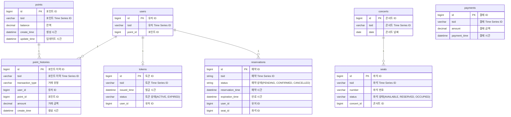
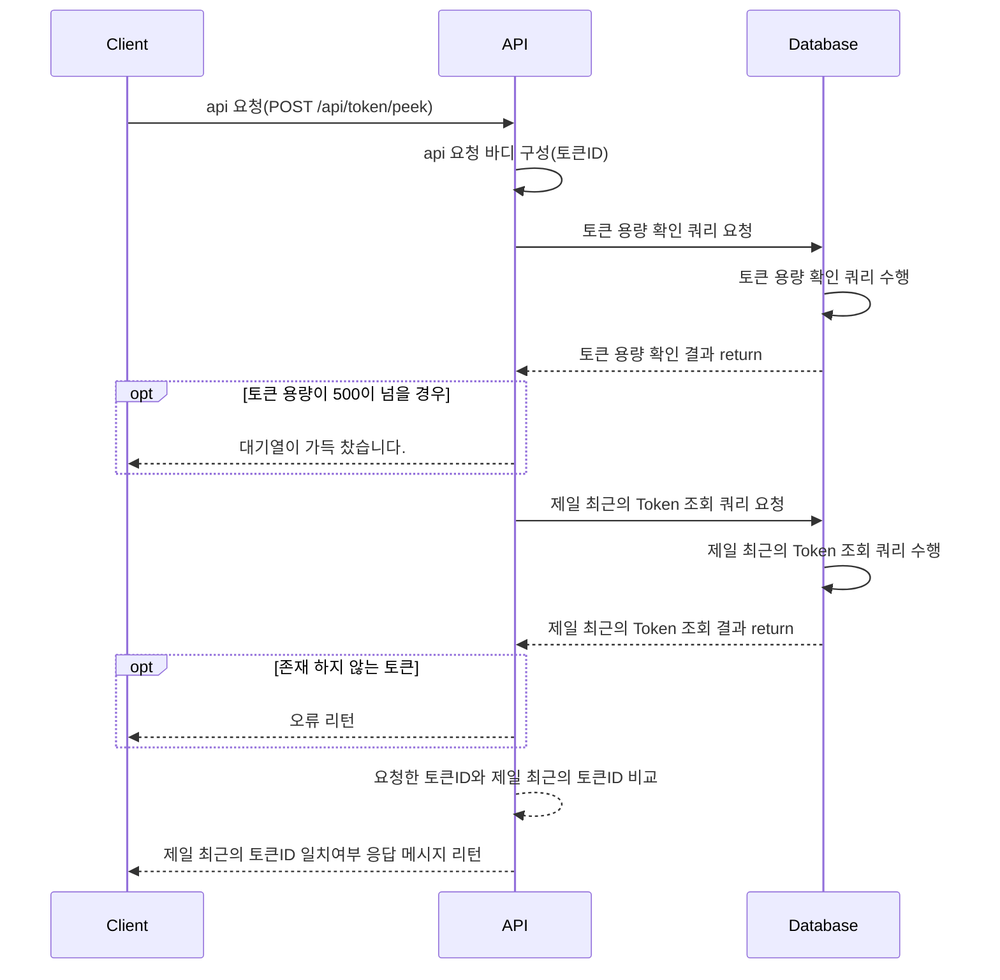
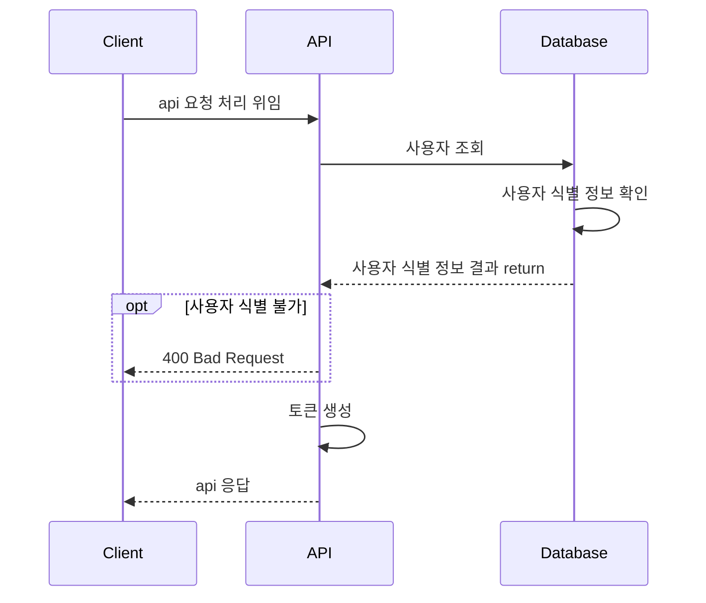
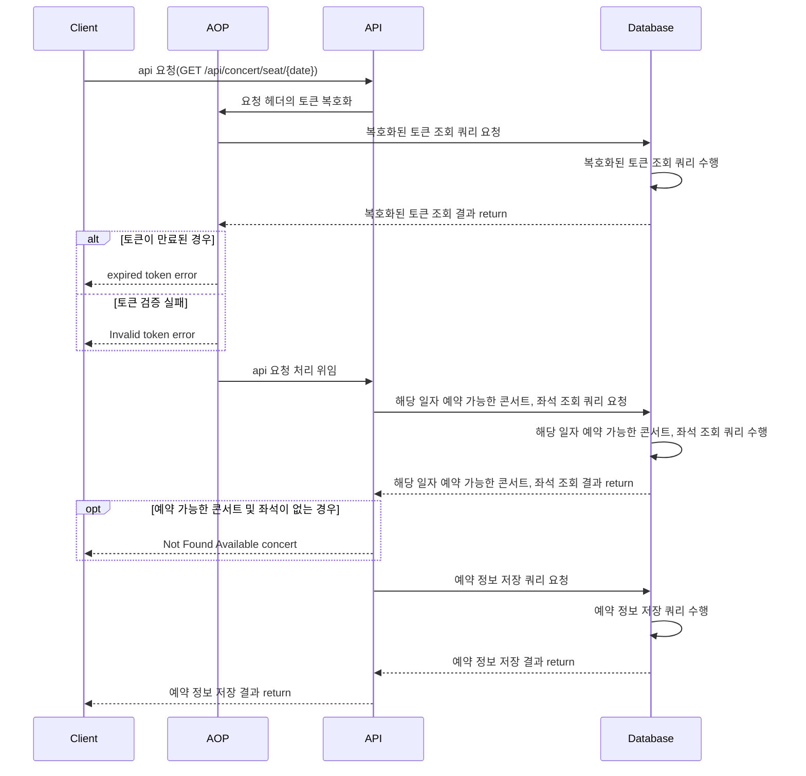
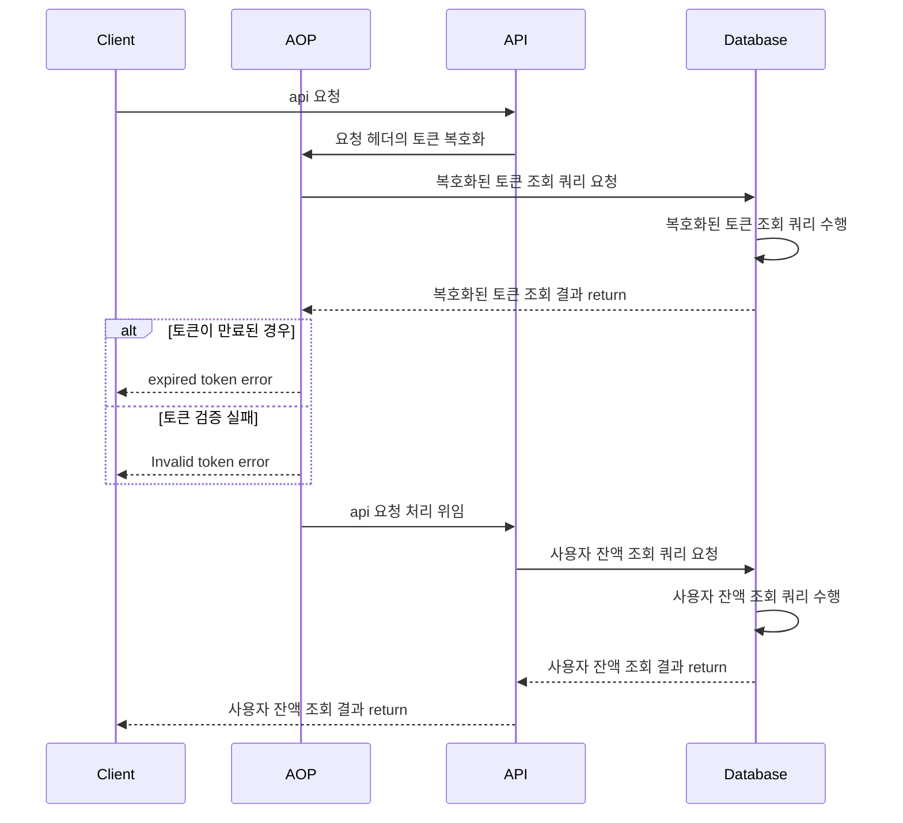
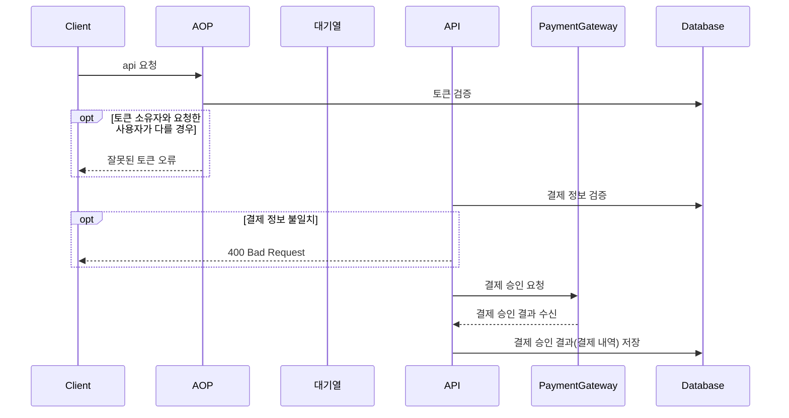

# Ticket
- 콘서트 예약 서비스 구현하기
- 대기열 시스템을 구축하고, 예약 서비스는 작업가능한 유저만 수행할 수 있도록 해야합니다.
- 사용자는 좌석예약 시에 미리 충전한 잔액을 이용합니다.
- 좌석 예약 요청시에, 결제가 이루어지지 않더라도 일정 시간동안 다른 유저가 해당 좌석에 접근할 수 없도록 합니다.

프로젝트를 구성하는데 필요한 마일스톤은 https://github.com/wanniDev/ticket/milestones 에서 확인할 수 있습니다.

## 데이터베이스 인덱스 구성 개요
- 데이터베이스 스키마에 적절한 인덱스를 구성하면, 데이터베이스 스캔 범위를 최소화하여 빠른 조회 성능을 기대할 수 있습니다.
- 적절한 인덱스를 구성하기 위해선, 데이터베이스의 카디널리티와 데이터 분포도의 특성을 파악해야 합니다.
- 데이터베이스의 카디널리티는 해당 컬럼의 중복되지 않는 값의 개수를 의미합니다. 카디널리티가 높을수록, 데이터의 중복수치가 낮습니다.
- 데이터베이스의 데이터 분포도는 해당 컬럼의 데이터가 얼마나 균등하게 분포되어 있는지를 의미합니다.
  - 데이터 분포도를 나타내는 공식은 대략 `1/고유 데이터 개수 * 100` 입니다.
  - 그래서 일반적으로 "분포도가 좋다"라는 표현은 카디널리티가 높은 경우를 의미합니다.
- 데이터베이스의 카디널리티와 데이터 분포도를 파악하여, 적절한 인덱스를 구성해보겠습니다.

### 인덱스 선정하기
테이블 별로, 컬럼을 카디널리티 내림차순으로 나열하면 아래와 같습니다.
```
-- `users` 테이블
`tsid`, `id`, `point_id`

-- `points` 테이블
`tsid`, `id`, `create_time`, `update_time`, `balance`

-- `tokens` 테이블
`tsid`, `id`, `user_id`, `issued_time`, `status`

-- `concerts` 테이블
`tsid`, `id`, `date`

-- `seats` 테이블
`tsid`, `id`, `concert_id`, `number`, `price`, `status`

-- `reservations` 테이블
`tsid`, `id`, `user_id`, `concert_id`, `status`, `reservation_time`, `expiration_time`

-- `payments` 테이블
`tsid`, `id`, `user_id`, `point_id`, `payment_time`, `amount`

-- `point_histories` 테이블
`tsid`, `id`, `user_id`, `point_id`, `create_time`, `transaction_type`, `amount`

-- `reservations_seats` 테이블
`id`, `reservation_id`, `seat_id`
```
인덱스 컬럼 지정 1순위: `tsid`
- `tsid`는 Time Series ID의 약자로, 고유한 시간을 나타내는 문자열입니다. 현재 프로젝트에서는 pk의 보조키로 활용되고 있습니다. 
  - 도메인 모델의 식별자 역할을 하므로, 사실상 카디널리티는 `id`와 동일합니다.
- 이러한 특성으로 `tsid`는 unique 제약조건을 가지고 있고, 인덱스로 구성되어 데이터 조회시 가장 많이 활용되고 있습니다.

인덱스 컬럼 지정 2순위: `${도메인명}_id`
- `${도메인명}_id`는 각 테이블의 fk 처럼 활용되는 컬럼입니다.
- 경우에 따라서, 카디널리티 자체는 날짜계열 컬럼(`data`, `create_time` 등)보다는 낮을 수 있습니다.
- 그러나, 해당 컬럼은 다른 테이블과의 관계를 나타내는 컬럼으로, 조건구문에서 날짜계열 컬럼보다는 더 많이 활용합니다.

인덱스 컬럼 지정 3순위: `날짜계열 컬럼`
- 해당 컬럼은 `date`, `create_time`, `update_time` 등의 날짜계열 컬럼입니다.
- 카디널리티는 낮을 수 있지만, 데이터 분포도가 좋은 컬럼입니다.
- 따라서, 해당 컬럼 역시 인덱스를 지정하면 데이터 조회 성능을 향상시킬 수 있습니다.
- 그러나, 테이블에 인덱스를 너무 많이 지정할 경우, 데이터 삽입 및 갱신 성능이 저하될 수 있습니다.
- 대기열 토큰의 경우, 가장 최근 시간에 발급된 토큰을 조회하는 쿼리가 많이 발생하므로, `issued_time` 컬럼에 인덱스를 지정하면 조회 성능을 향상시킬 수 있습니다.

인덱스 컬럼 지정 4순위: `상태계열 컬럼`
- 해당 컬럼은 `status`와 같이 상태를 나타내는 컬럼입니다.
- 대체로 카디널리티가 제일 낮습니다.
- 인덱스를 적용하면 좋을수도 있지만, 각 도메인의 id 별로 상태가 변경되는 경우가 많고, 절대적인 데이터 갯수가 적은 편입니다.
  - 인덱스는 데이터의 조회 성능을 높이는 대신, 추가, 갱신 성능을 저하시킬 수 있습니다.
  - 데이터의 갯수가 적은 경우, 인덱스를 지정해도 데이터베이스 스캔 범위를 줄이는 효과가 미미할 수 있습니다.

요약
- 공통으로 `tsid` 컬럼에 인덱스를 지정하는 것은 필수입니다.
- `id`의 경우, pk로서 클러스터드 인덱스로 구성되어 있으므로, 별도로 인덱스를 지정할 필요가 없습니다.
- `${도메인명}_id` 컬럼은 각 테이블의 fk처럼 활용되는 컬럼이므로, 인덱스를 지정하는 것이 좋습니다.
- 날짜계열 컬럼은 데이터 분포도가 좋으므로, 인덱스를 지정하는 것이 좋습니다.
  - 하지만, 인덱스를 지정할 경우, 데이터 삽입 및 갱신 성능이 저하될 수 있으므로, 적절한 상황에서 인덱스를 지정하는 것이 좋습니다.
  - 이번 프로젝트의 경우, 콘서트, 토큰과 같이 날짜계열 컬럼을 조건구문으로 활용하는 테이블에만 인덱스를 지정하는 것이 좋습니다.
- 상태계열 컬럼은 특성상 갱신 빈도수가 높으므로, 바로 인덱스를 적용하는 것보다는 시연 후에 데이터의 절대적인 갯수룰 보고 결정하는 것이 좋습니다.

주의사항
- 인덱스를 이용한 조회를 할 경우, 사용하는 연산자에 따라 인덱스 적용이 안될 수 있습니다. 따라서, 쿼리를 적용하기전에 해당 쿼리를 분석을 선행해야합니다.
- 만약 테이블 하나에 여러 컬럼이 인덱스로 지정되어 있다면, 카디널리티가 높은 순으로 배치해야합니다.
  - reservation 테이블을 예로들자면, `tsid`, `user_id`, `concert_id` 순으로 인덱스를 지정할 수 있습니다.

## api 주요 데이터베이스 조회 성능 개선
- 비즈니스 로직 수행 중 단건 쿼리 여러개로 의존하는 루트 도메인 엔티티을 조회하는 쿼리는 join을 활용하여 사용하는 쿼리의 횟수를 줄였습니다.
- 연관관계에 속한 도메인의 식별자(fk)는 인덱스로 구성하였습니다.
- 도메인 엔티티 구성시, 연관관계로 지정된 jpa 엔티티를 지우고 해당 엔티티의 식별자로 대체하여 특정 엔티티 조회시, 다른 엔티티를 추가로 조회하는 현상을 방지하였습니다.


## 데이터베이스 스키마



## 동시성 시나리오

### 동시성 이슈가 발생할 수 있는 경우 1: 예약시 좌석 선점

예약 프로세스

1. 사용자 조회
2. 해당 날짜 콘서트 조회
3. 해당 날짜 좌석 조회
4. 예약 등록
5. 사용자 포인트 차감

동시성 이슈가 발생하는 부분

동시에 여러 트랜잭션이 좌석 예약 상태 조회 중 발생하는 dirty read 현상

Txid 100 손님, Txid 200 손님이 동시에 예약을 했을 경우.

- MySQL 기준으로 일반적으로 읽기의 경우, 가장 마지막에 커밋된 데이터를 읽음(commited read + MVCC)
- MVCC 특성에 따라 어느 트랜잭션이 먼저 조회를 수행하든 다른 트랜잭션의 조회 작업을 막지 않음(MySQL + innodb 에서 일반 SELECT 구문은 잠금없는 읽기)
- 따라서, 동시에 예약을 진행할 경우, 두 트랜잭션 높은 확률로 예약으로 점유되지 않은 상태로 커밋된 좌석을 조회하게됨 (dirty read 발생)
- 이러한 현상은 같은 좌석으로 두개 이상의 중복된 예약을 수행하게 됨.

따라서, 2개 이상의 트랜잭션이 발생할 경우를 대비하여 좌석 선점을 위한 락 매커니즘을 구성해야한다.

#### 대응책

낙관적락

- 특징
    - 경합이 잘 발생하지 않는다는 가정하에 수행하는 락 매커니즘
    - 트랜잭션간의 상호배제를 수행하지 않기에 성능 저하x
    - version control 역할의 컬럼을 활용함.
        - postgreSQL에서는 'first-updater-win'으로 동작함
        - jpa를 활용할 경우, MySQL로도 특정 타입의 컬럼을 통해 동작함
            - Short
            - Integer
            - Long
            - Timestamp
    - 두개 이상의 트랜잭션이 동시에 read를 수행하더라도 두 트랜잭션에서 조회한 version이 불일치하면 하나의 트랜잭션은 실패한다.
- 주의사항
    - 조회 쿼리에 대한 상호배제가 이루어지지 않기 때문에 트랜잭션 범위보다 락의 범위가 더 넓을 경우, 의도와 다른 version control 결과를 가져올 수 있음
    - retry 및 보상 트랜잭션과 같은 부가 기능 추가로 인해, 비즈니스 로직이 복잡해질 수 있음
    - jpa를 활용할 경우, version 역할을 하는 컬럼은 직접 건들여선 안됨. 그러나 벌크 연산의 경우, 직접 건들여야함
    - 충돌이 자주 발생한다면, 반복된 쿼리를 수행하는 경우가 많아지므로 오히려 비관적락이 더 좋을 수 있음

**비관적락 [채택]**

- 특징
    - 경합이 자주 발생한다는 가정하에 수행하는 락 매커니즘
    - 트랜잭션간의 상호배제를 수행하기에 트래픽이 몰릴경우 각 트랜잭션의 응답시간 누적으로 인해 성능 저하가 발생할 수 있음
    - 일반적인 select 쿼리 마지막 부분에 for update 구문을 추가하여, locking read 수행
    - 두개 이상의 트랜잭션이 동시에 read를 수행하려고 할 경우, 먼저 락을 획득한 트랜잭션만 read를 수행하고, 나머지 트랜잭션은 먼저 락을 획득한 트랜잭션이 커밋을 완료하고 락을 반납할때까지 대기함
- 주의 사항
    - 상호배제를 통한 락 관리는 필연적으로 성능저하가 찾아오므로,
    - read의 경우 배제 락을 획득한 트랜잭션끼리만, 상호배제가 적용된다.
    - 여러 레코드를 대상으로 배타락을 걸 때 데드락을 조심해라...

> ### 꼭 데이터베이스 락을 사용해야 하는가?
> - 카프카+카프카 스트림즈를 활용한 락 관리, 레디스를 활용한 분산락 관리 등 다양한 락 관리 방법이 있다.
> - 그러나, 데이터베이스 락을 통해 트랜잭션 동시성 관리 경험을 제대로 쌓아보고 싶다.
> - 선호하는 방향 
>     - 비관락으로 우선 동시성 해결 -> 
>     - 성능 이슈 발생 -> 
>     - 조회 용, Lock 연산 용 테이블 분리 ->
>     - 더 나은 성능 개선을 위해 트랜잭션 범위 축소 -> 
>     - 복잡해지는 코드 개선 및 확장성을 위해 레디스 및 카프카를 활용
> - **최고의 방법을 한번에 찾아내는 것보다 주어진 상황에서 최적해를 찾는 과정을 먼저 겪어보고 싶었다.**

> ### 그럼 레디스 및 카프카를 활용한 방법은 완벽할까? 
> - 레디스를 활용한 락 관리는 레디스의 특성상, 메모리에 저장되기 때문에, 레디스 서버가 다운되면 락이 해제되는 문제가 있음.
> - 카프카를 활용한 방법의 경우, 카프카의 특성상 보상 트랜잭션을 어떻게 처리할지 고민해보아야 한다. 
> - 따라서, 먼저 데이터베이스 락을 활용한 방법을 구현하여야 레디스 및 카프카를 활용한 방법에 문제가 생겨도 대응할 수 있도록 구성할 수 있을 듯 하다.
> - 먼저 비관락으로 구현하고, 성능이슈가 발생하는 상황을 만들어 성능을 개선하는 방향으로 진행할 예정.
> - 그 다음에 개선된 방법이 무엇이 되었든, 장애 발생으로 인해 해당 방법이 활용하는 것이 불가능할 경우, 복구가 될때까지 기존의 데이터베이스 락을 쓰는 방법을 고려할 예정.

## 브랜치 전략: Github Flow
Github Flow는 main 브랜치를 배포 가능한 상태로 유지하고, 새로운 기능이나 버그 수정을 위한 브랜치를 생성하여 작업한 후, 작업이 완료되면 master 브랜치로 PR을 보내는 방식입니다.
### Github Flow를 사용하는 이유
- 간단하고 직관적이다.
- 각 기능별 작업 기간이 짧기때문에 브랜치를 생성하고 병합하는 과정이 빠른 전략이 필요합니다.
- 동시에 여러 기능을 개발하는 경우에도 충돌이 발생할 확률이 낮은 방법이 필요합니다.
### Github Flow 작업 흐름
1. 브랜치 생성: main 브랜치 하나에 의존하기 때문에 브랜치 생성시, 브랜치 이름을 통해 의도를 명확하게 드러내는 것이 중요합니다.
2. 개발 작업 및 커밋과 푸시
   - 개발을 진행하면서 커밋을 남깁니다.
   - 커밋을 남길 때는 커밋 메시지를 명확하게 작성합니다.
   - 수시로 push 합니다.
   - remote 저장소에 작업 내역을 공유하여 다른 사람들도 확인할 수 있도록 합니다.
3. Pull Request 생성
4. 코드 리뷰 및 피드백
5. 테스트: 단위 테스트 뿐만 아니라, 라이브 서버에 직접 배포해보면서, 실제로 배포할 수 있는 상태인지 검증합니다.
### 커밋 메세지 제목 작성 가이드

> 출처 : [Git Commit Message StyleGuide](https://github.com/slashsbin/styleguide-git-commit-message#message-subjectfirst-line)

**"태그: 제목"의 형태이고, : 뒤에 공백이 있음에 유의한다.**

| 태그 이름 | 설명                                                         |
| --------- | ------------------------------------------------------------ |
| Feat      | 새로운 기능을 추가할 경우                                    |
| Fix       | 버그를 고친 경우                                             |
| !HOTFIX   | 급하게 치명적인 버그를 고쳐야하는 경우                       |
| Refactor  | 프로덕션 코드 리팩토링                                       |
| Comment   | 필요한 주석 추가 및 변경                                     |
| Document  | 문서를 수정한 경우                                           |
| Test      | 테스트 추가, 테스트 리팩토링(프로덕션 코드 변경 X)           |
| Chore     | 빌드 task 업데이트, 패키지 매니저를 설정하는 경우(프로덕션 코드 변경 X) |
| Rename    | 파일 혹은 폴더명을 수정하거나 옮기는 작업만인 경우           |
| Remove    | 파일을 삭제하는 작업만 수행한 경우                           |

## CI/CD workflow
- Github Actions를 사용하여 CI/CD를 구축합니다.
- Github Actions는 Github에서 제공하는 CI/CD 서비스로, Github 저장소에 있는 코드를 기반으로 워크플로우를 자동화할 수 있습니다.
- Jenkins, k8s 등 다양한 ci/cd 툴이 있지만, 툴 사용법 보다는 ci/cd의 개념을 이해하고, 실제로 구축해보는 것이 중요하다고 판단하여, Github Actions를 사용합니다.
- **현재는 CI에 집중하고 있습니다.**

### CI(Continuous Integration)
- 끊임없이 코드를 통합하고 테스트를 수행하여 품질을 유지하는 프로세스입니다.
- 제품 코드를 최신화하고 바로 배포할 수 있는 문화를 이끌어내는 것이 중요하기에 어떤 도구를 쓰는 것보다 주어진 상황에 맞게 적절한 파이프라인을 구성하는 것이 더 중요합니다.
- 해당 프로젝트는 코드를 커밋하거나 pr을 올릴때마다 CI 파이프라인이 동작하도록 구성하였습니다.

### CI process
1. checkout
   - Github Actions이 실행되는 환경에 코드를 가져옵니다.
2. test : 제품 코드에 대한 테스트를 수행하고, 실패할 경우 빌드를 중단합니다.
3. lint : 코드 스타일을 검사하고, 실패할 경우 빌드를 중단합니다. 본 프로젝트는 ktlint를 통해, kotlin 공식 코딩 컨벤션을 준수하도록 합니다.
4. build
  - 2,3번의 작업은 gradlew에서 build task를 실행할 때, test와 lint를 선행하고 실패할 경우 build를 중단합니다.

### CD process
- CI 파이프라인이 성공하면, CD 파이프라인이 실행되도록 구성할 예정입니다.
- jib를 사용하여, was의 docker 이미지 빌드 프로세스를 단순화하고, 빌드 속도를 높이는 방향을 채택 하였습니다.
- jib를 활용하면, was의 빌드 및 배포 자동화가 더 수월해지며, layer caching을 통해 빌드 속도를 높일 수 있습니다.
- 현재 프로젝트에서는 쉘스크립트를 통해, 애플리케이션 배포를 수행하고 있습니다.
- 관리하는 컨테이너가 많아져 복잡해질 경우, 컨테이너 오케스트레이션을 구성하고 그에 맞는 도구를 선택하여 CD 파이프라인을 고도화할 예정입니다.


## 요구사항 분석
콘서트 예약 서비스를 구현하기 위해선 아래 6가지의 api가 필요합니다.
- 유저 토큰 발급 API
- 예약 가능 날짜 조회 API
- 예약 가능 좌석 조회 API
- 좌석 예약 요청 API
- 잔액 충전 / 조회 API
- 결제 API

## 플로우 차트
### 0. 유저 토큰 대기열 확인
1. 클라이언트 토큰 입력 수신
2. 토큰이 유효한지 확인
3. 토큰이 유효하면 대기열 확인(peek)
4. 대기열 순번의 토큰과 클라이언트 토큰이 일치하는지 확인
5. 일치하면 true 리턴
6. 일치하지 않으면 false 리턴

### 1. 유저 토큰 발급 API


### 2. 예약 가능 날짜 조회 API


### 3. 예약 가능 좌석 조회 API


### 4. 좌석 예약 요청 API


### 5. 잔액 충전 API


### 6. 잔액 조회 API


### 7. 결제 API


## 시퀀스 다이어그램
> 이 부분은 새로운 다이어그램 작성 툴에 대한 학습을 해보기위해 별도로 진행해보는 작업입니다. </br>
> 따라서, 아직 모든 내용이 제대로 반영된 부분은 아닐 수 있습니다.

### 0. 유저 토큰 대기열 검증
현재 주어진 토큰이 대기열 우선순위에 들었는지 확인하는 API 입니다.


### 1. 유저 토큰 발급 API


### 2. 예약 가능 좌석 조회 API
- 목적 : 사용자가 특정 날짜와 좌석에 대해 예약을 요청할 수 있어야 합니다.
- 핵심 요구사항 :
  - 사용자는 특정 날짜를 선택하여 그 날짜에 대한 예약 가능 좌석을 확인할 수 있어야 합니다.
- 제약사항 :
  - 이미 예약되었거나 임시 배정된 좌석은 예약 가능한 좌석 목록에 포함되지 않아야 합니다.


### 3. 좌석 예약 요청 API
- 목적 : 사용자가 특정 날짜와 좌석에 대해 예약을 요청할 수 있어야 합니다.
- 핵심 요구사항 :
  - 사용자는 토큰을 사용하여 예약 요청을 해야 합니다.
  - 예약이 성공적으로 요청되면, 해당 좌석은 일정 시간 동안 사용자에게 임시 배정됩니다.
- 제약사항 :
  - 한 사용자가 동시에 여러 좌석을 예약할 수 없습니다.
  - 임시 배정 시간 내에 결제가 완료되지 않으면, 좌석 배정이 자동으로 해제됩니다.

### 4. 잔액 충전 / 조회 API
#### 잔액 충전
- 목적 : 사용자가 예약 결제를 위해 잔액을 충전할 수 있어야 합니다.
- 핵심 요구사항 :
  - 사용자는 특정 금액을 지정하여 잔액을 충전할 수 있습니다.
- 제약사항 :
  - 충전 금액은 양수여야 합니다. 


#### 잔액 조회
- 목적 : 사용자가 자신의 현재 잔액을 조회할 수 있어야 합니다.
- 핵심 요구사항 :
  - 사용자는 자신의 잔액 정보를 언제든지 조회할 수 있어야 합니다.
- 제약사항:
  - 조회는 사용자 본인의 잔액에 한정됩니다.

    
### 5. 결제 API
> 해당 API는 PG 사에서 제공하는 결제 모달창 UI를 통해 결제 정보를 입력한 이후에 호출되는 API입니다.</br>
> 이번 프로젝트에서는 예약과 대기열등 핵심 비즈니스 로직 구현에 집중하기 위해 PG 연동은 생략하였습니다. </br>

- 목적: 사용자가 좌석 예약에 대해 결제를 완료할 수 있어야 합니다.
- 핵심 요구사항:
  - 사용자는 잔액을 이용하여 예약한 좌석에 대한 결제를 진행할 수 있어야 합니다.
  - 결제가 성공하면, 예약이 확정되고 해당 좌석은 사용자에게 배정됩니다.
- 제약사항:
  - 사용자의 잔액은 결제 금액 이상이어야 합니다.
  - 결제 요청은 유효한 예약 정보에 대해서만 가능해야 합니다.

