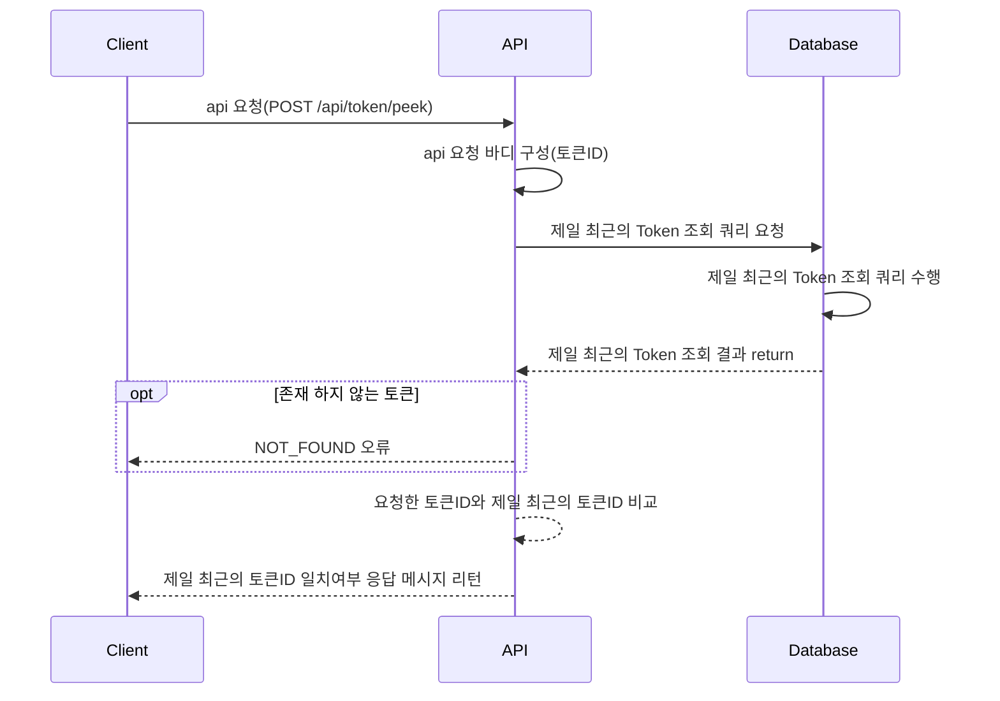
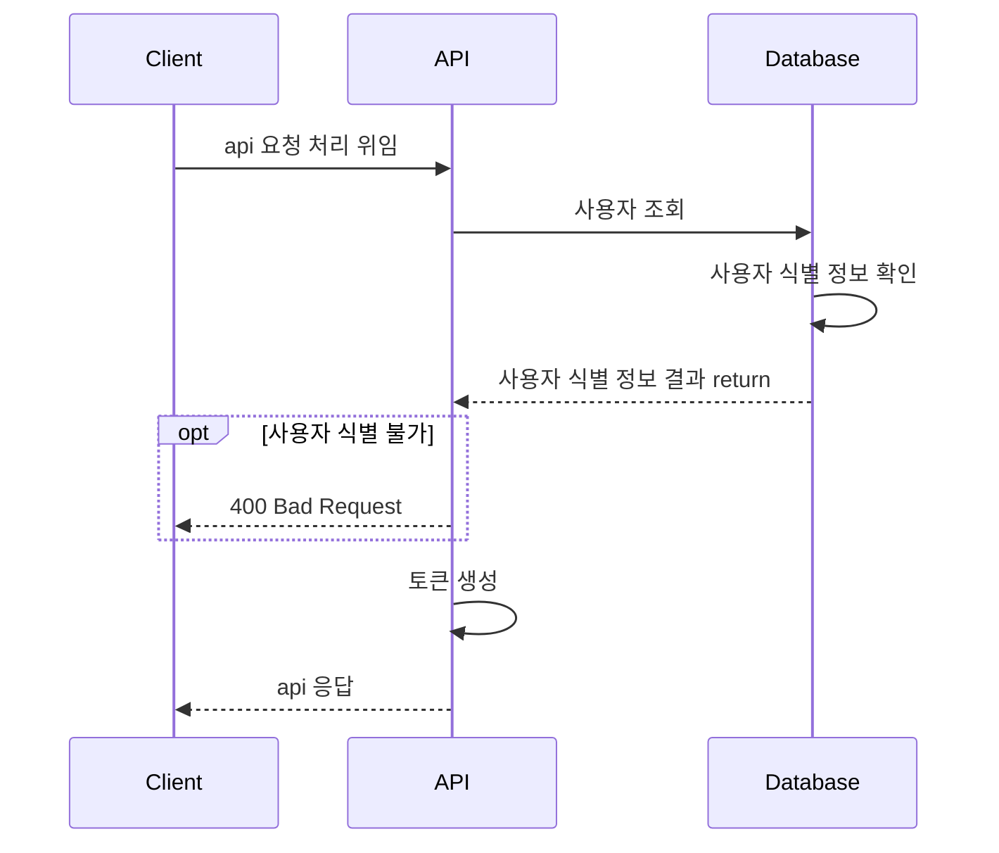
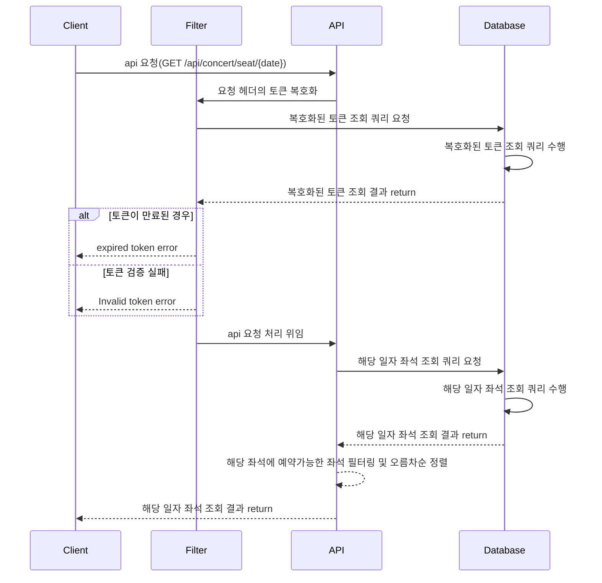
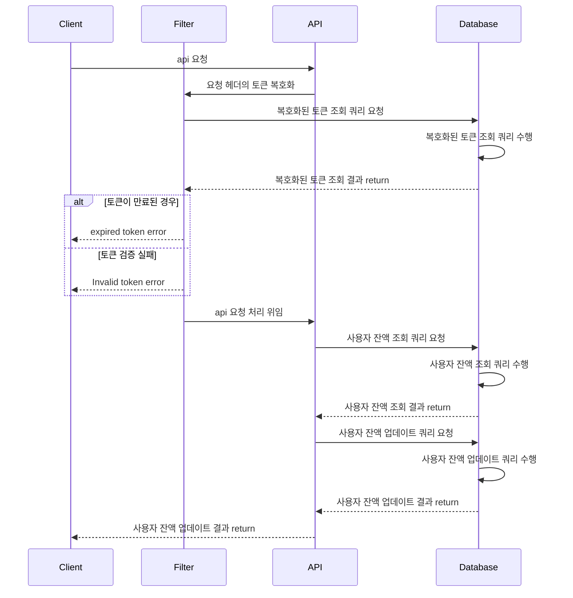
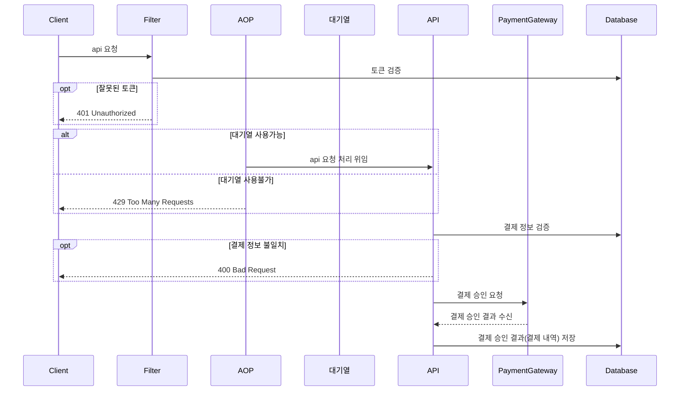
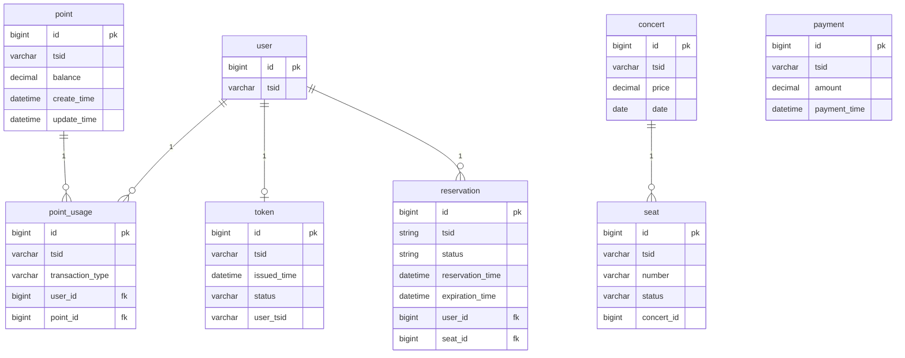

# Ticket
- 콘서트 예약 서비스 구현하기
- 대기열 시스템을 구축하고, 예약 서비스는 작업가능한 유저만 수행할 수 있도록 해야합니다.
- 사용자는 좌석예약 시에 미리 충전한 잔액을 이용합니다.
- 좌석 예약 요청시에, 결제가 이루어지지 않더라도 일정 시간동안 다른 유저가 해당 좌석에 접근할 수 없도록 합니다.

프로젝트를 구성하는데 필요한 마일스톤은 https://github.com/wanniDev/ticket/milestones 에서 확인할 수 있습니다.

## 동시성 시나리오

### 예약시 좌석 선점

예약 프로세스

1. 사용자 조회
2. 해당 날짜 콘서트 조회
3. 해당 날짜 좌석 조회
4. 예약 등록
5. 사용자 포인트 차감

동시성 이슈가 발생하는 부분

동시에 여러 트랜잭션이 좌석 예약 상태 조회 중 발생하는 dirty read 현상

Txid 100 손님, Txid 200 손님이 동시에 예약을 했을 경우.

- MySQL 기준으로 일반적으로 읽기의 경우, 가장 마지막에 커밋된 데이터를 읽음(commited read + MVCC)
- MVCC 특성에 따라 어느 트랜잭션이 먼저 조회를 수행하든 다른 트랜잭션의 조회 작업을 막지 않음(shared lock)
- 따라서, 동시에 예약을 진행할 경우, 두 트랜잭션 높은 확률로 예약으로 점유되지 않은 상태로 커밋된 좌석을 조회하게됨 (dirty read 발생)
- 이러한 현상은 같은 좌석으로 두개 이상의 중복된 예약을 수행하게 됨.

#### 대응책

낙관적락

- 특징
    - 경합이 잘 발생하지 않는다는 가정하에 수행하는 락 매커니즘
    - 트랜잭션간의 상호배제를 수행하지 않기에 성능 저하x
    - version control 역할의 컬럼을 활용함.
        - postgreSQL에서는 'first-updater-win' 로 동작함
        - jpa를 활용할 경우, MySQL로도 특정 타입의 컬럼을 통해 동작함
            - Short
            - Integer
            - Long
            - Timestamp
    - 두개 이상의 트랜잭션이 동시에 read를 수행하더라도 두 트랜잭션에서 조회한 version이 불일치하면 하나의 트랜잭션은 실패한다.
- 주의사항
    - retry 및 보상 트랜잭션과 같은 부가 기능 추가로 인해, 비즈니스 로직이 복잡해질 수 있음
    - jpa를 활용할 경우, version 역할을 하는 컬럼은 직접 건들여선 안됨. 그러나 벌크 연산의 경우, 직접 건들여야함
    - 충돌이 자주 발생한다면, 반복된 쿼리를 수행하는 경우가 많아지므로 오히려 비관적락이 더 좋을 수 있음

**비관적락 [채택]**

- 특징
    - 경합이 자주 발생한다는 가정하에 수행하는 락 매커니즘
    - 트랜잭션간의 상호배제를 수행하기에 트래픽이 몰릴경우 각 트랜잭션의 응답시간 누적으로 인해 성능 저하가 발생할 수 있음
    - 일반적인 select 쿼리 마지막 부분에 for update 구문을 추가하여, locking read 수행
    - 두개 이상의 트랜잭션이 동시에 read를 수행하려고 할 경우, 먼저 락을 획득한 트랜잭션만 read를 수행하고, 나머지 트랜잭션은 먼저 락을 획득한 트랜잭션이 커밋을 할때까지 대기하고 락을 얻으면 read를 수행하게 됨
- 주의 사항
    - 상호배제를 통한 락 관리는 필연적으로 성능저하가 찾아오므로,
    - read의 경우 배제 락을 획득한 트랜잭션끼리만, 상호배제가 적용된다.
    - 데드락을 조심해라...

분산락

- 분산락자체를 잘 모르고, 아직 낙관적락 비관적락을 제대로 이해하고 이를 바탕으로 다양한 장애 상황을 겪어보지 않았으므로 보류(to be continue....)

## 브랜치 전략: Github Flow
Github Flow는 main 브랜치를 배포 가능한 상태로 유지하고, 새로운 기능이나 버그 수정을 위한 브랜치를 생성하여 작업한 후, 작업이 완료되면 master 브랜치로 PR을 보내는 방식입니다.
### Github Flow를 사용하는 이유
- 간단하고 직관적이다.
- 각 기능별 작업 기간이 짧기때문에 브랜치를 생성하고 병합하는 과정이 빠른 전략이 필요합니다.
- 동시에 여러 기능을 개발하는 경우에도 충돌이 발생할 확률이 낮은 방법이 필요합니다.
### Github Flow 작업 흐름
1. 브랜치 생성: main 브랜치 하나에 의존하기 때문에 브랜치 생성시, 브랜치 이름을 통해 의도를 명확하게 드러내는 것이 중요합니다.
2. 개발 작업 및 커밋과 푸시
   - 개발을 진행하면서 커밋을 남깁니다.
   - 커밋을 남길 때는 커밋 메시지를 명확하게 작성합니다.
   - 수시로 push 합니다.
   - remote 저장소에 작업 내역을 공유하여 다른 사람들도 확인할 수 있도록 합니다.
3. Pull Request 생성
4. 코드 리뷰 및 피드백
5. 테스트: 단위 테스트 뿐만 아니라, 라이브 서버에 직접 배포해보면서, 실제로 배포할 수 있는 상태인지 검증합니다.
### 커밋 메세지 제목 작성 가이드

> 출처 : [Git Commit Message StyleGuide](https://github.com/slashsbin/styleguide-git-commit-message#message-subjectfirst-line)

**"태그: 제목"의 형태이고, : 뒤에 공백이 있음에 유의한다.**

| 태그 이름 | 설명                                                         |
| --------- | ------------------------------------------------------------ |
| Feat      | 새로운 기능을 추가할 경우                                    |
| Fix       | 버그를 고친 경우                                             |
| !HOTFIX   | 급하게 치명적인 버그를 고쳐야하는 경우                       |
| Refactor  | 프로덕션 코드 리팩토링                                       |
| Comment   | 필요한 주석 추가 및 변경                                     |
| Document  | 문서를 수정한 경우                                           |
| Test      | 테스트 추가, 테스트 리팩토링(프로덕션 코드 변경 X)           |
| Chore     | 빌드 task 업데이트, 패키지 매니저를 설정하는 경우(프로덕션 코드 변경 X) |
| Rename    | 파일 혹은 폴더명을 수정하거나 옮기는 작업만인 경우           |
| Remove    | 파일을 삭제하는 작업만 수행한 경우                           |

## CI/CD workflow
- Github Actions를 사용하여 CI/CD를 구축합니다.
- Github Actions는 Github에서 제공하는 CI/CD 서비스로, Github 저장소에 있는 코드를 기반으로 워크플로우를 자동화할 수 있습니다.
- Jenkins, k8s 등 다양한 ci/cd 툴이 있지만, 툴 사용법 보다는 ci/cd의 개념을 이해하고, 실제로 구축해보는 것이 중요하다고 판단하여, Github Actions를 사용합니다.
- **현재는 CI에 집중하고 있습니다.**

### CI(Continuous Integration)
- 끊임없이 코드를 통합하고 테스트를 수행하여 품질을 유지하는 프로세스입니다.
- 제품 코드를 최신화하고 바로 배포할 수 있는 문화를 이끌어내는 것이 중요하기에 어떤 도구를 쓰는 것보다 주어진 상황에 맞게 적절한 파이프라인을 구성하는 것이 더 중요합니다.
- 해당 프로젝트는 코드를 커밋하거나 pr을 올릴때마다 CI 파이프라인이 동작하도록 구성하였습니다.

### CI process
1. checkout
   - Github Actions이 실행되는 환경에 코드를 가져옵니다.
2. test : 제품 코드에 대한 테스트를 수행하고, 실패할 경우 빌드를 중단합니다.
3. lint : 코드 스타일을 검사하고, 실패할 경우 빌드를 중단합니다. 본 프로젝트는 ktlint를 통해, kotlin 공식 코딩 컨벤션을 준수하도록 합니다.
4. build
  - 2,3번의 작업은 gradlew에서 build task를 실행할 때, test와 lint를 선행하고 실패할 경우 build를 중단합니다.

### CD process
- CI 파이프라인이 성공하면, CD 파이프라인이 실행되도록 구성할 예정입니다.
- jib를 사용하여, was의 docker 이미지 빌드 프로세스를 단순화하고, 빌드 속도를 높이는 방향을 채택 하였습니다.
- jib를 활용하면, was의 빌드 및 배포 자동화가 더 수월해지며, layer caching을 통해 빌드 속도를 높일 수 있습니다.
- 현재 프로젝트에서는 쉘스크립트를 통해, 애플리케이션 배포를 수행하고 있습니다.
- 관리하는 컨테이너가 많아져 복잡해질 경우, 컨테이너 오케스트레이션을 구성하고 그에 맞는 도구를 선택하여 CD 파이프라인을 고도화할 예정입니다.

## 요구사항 분석
콘서트 예약 서비스를 구현하기 위해선 아래 6가지의 api가 필요합니다.
- 유저 토큰 발급 API
- 예약 가능 날짜 조회 API
- 예약 가능 좌석 조회 API
- 좌석 예약 요청 API
- 잔액 충전 / 조회 API
- 결제 API

## 플로우 차트
### 0. 유저 토큰 대기열 확인
1. 클라이언트 토큰 입력 수신
2. 토큰이 유효한지 확인
3. 토큰이 유효하면 대기열 확인(peek)
4. 대기열 순번의 토큰과 클라이언트 토큰이 일치하는지 확인
5. 일치하면 true 리턴
6. 일치하지 않으면 false 리턴

### 1. 유저 토큰 발급 API

### 2. 예약 가능 날짜 조회 API

### 3. 예약 가능 좌석 조회 API

### 4. 좌석 예약 요청 API

### 5. 잔액 충전 API

### 6. 잔액 조회 API

### 7. 결제 API

## 시퀀스 다이어그램
> 이 부분은 새로운 다이어그램 작성 툴에 대한 학습을 해보기위해 별도로 진행해보는 작업입니다.  
> 따라서, 아직 모든 내용이 제대로 반영된 부분은 아닐 수 있습니다.

### 0. 유저 토큰 대기열 검증
현재 주어진 토큰이 대기열 우선순위에 들었는지 확인하는 API 입니다.

### 1. 유저 토큰 발급 API

### 2. 예약 가능 좌석 조회 API
- 목적 : 사용자가 특정 날짜와 좌석에 대해 예약을 요청할 수 있어야 합니다.
- 핵심 요구사항 :
  - 사용자는 특정 날짜를 선택하여 그 날짜에 대한 예약 가능 좌석을 확인할 수 있어야 합니다.
- 제약사항 :
  - 이미 예약되었거나 임시 배정된 좌석은 예약 가능한 좌석 목록에 포함되지 않아야 합니다.

### 3. 좌석 예약 요청 API
- 목적 : 사용자가 특정 날짜와 좌석에 대해 예약을 요청할 수 있어야 합니다.
- 핵심 요구사항 :
  - 사용자는 토큰을 사용하여 예약 요청을 해야 합니다.
  - 예약이 성공적으로 요청되면, 해당 좌석은 일정 시간 동안 사용자에게 임시 배정됩니다.
- 제약사항 :
  - 한 사용자가 동시에 여러 좌석을 예약할 수 없습니다.
  - 임시 배정 시간 내에 결제가 완료되지 않으면, 좌석 배정이 자동으로 해제됩니다.

### 4. 잔액 충전 / 조회 API
#### 잔액 충전
- 목적 : 사용자가 예약 결제를 위해 잔액을 충전할 수 있어야 합니다.
- 핵심 요구사항 :
  - 사용자는 특정 금액을 지정하여 잔액을 충전할 수 있습니다.
- 제약사항 :
  - 충전 금액은 양수여야 합니다. 

#### 잔액 조회
- 목적 : 사용자가 자신의 현재 잔액을 조회할 수 있어야 합니다.
- 핵심 요구사항 :
  - 사용자는 자신의 잔액 정보를 언제든지 조회할 수 있어야 합니다.
- 제약사항:
  - 조회는 사용자 본인의 잔액에 한정됩니다.

    
### 5. 결제 API
> 해당 API는 PG 사에서 제공하는 결제 모달창 UI를 통해 결제 정보를 입력한 이후에 호출되는 API입니다. 
> 이번 프로젝트에서는 예약과 대기열등 핵심 비즈니스 로직 구현에 집중하기 위해 PG 연동은 생략하였습니다.  

- 목적: 사용자가 좌석 예약에 대해 결제를 완료할 수 있어야 합니다.
- 핵심 요구사항:
  - 사용자는 잔액을 이용하여 예약한 좌석에 대한 결제를 진행할 수 있어야 합니다.
  - 결제가 성공하면, 예약이 확정되고 해당 좌석은 사용자에게 배정됩니다.
- 제약사항:
  - 사용자의 잔액은 결제 금액 이상이어야 합니다.
  - 결제 요청은 유효한 예약 정보에 대해서만 가능해야 합니다.

## 데이터베이스 스키마
> tsid는 Time Series ID의 약자로, 고유한 시간을 나타내는 문자열입니다. 현재 프로젝트에서는 pk의 보조키로 활용되고 있습니다.

